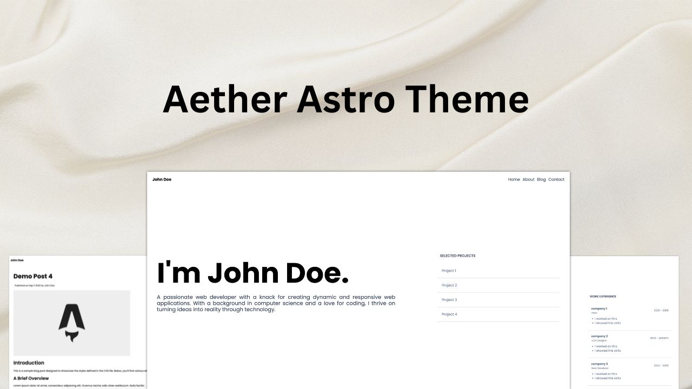
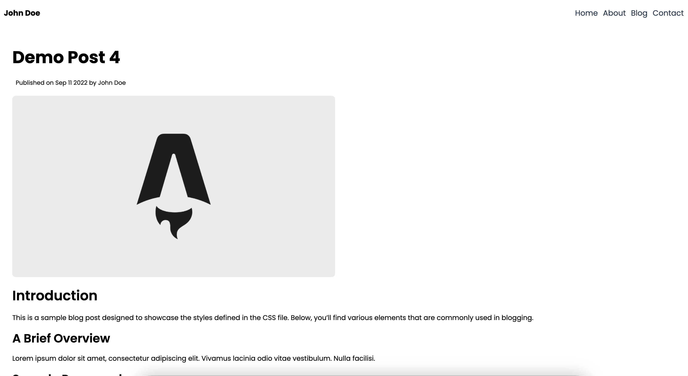

# Aether Astro Theme



Aether is a sleek, minimalist portfolio theme designed for Astro.js, perfect for those who value simplicity and speed. With a focus on clean design and efficient performance.

## Features

1. Minimal & Lightweight Design
2. Perfect Lighthouse Score
3. Single file configuration
4. Most Information at a glance

 ## Installation
 
1. clone the repo 
```
git clone https://github.com/thatsmanmeet/Aether-astro-theme
```
2. Open the folder and install node modules.
```
npm install
```
3. Configure the theme from the `src/data.js` file. For adding blogs, you can go to `src/pages/blogs` and you can add your own `md` files. Copy the frontmatter in every new post file. Here's the frontmatter.

```
---
layout: ../../layouts/BlogLayout.astro
title: "Demo Post 1"
description: "Lorem ipsum dolor sit amet, consectetur adipiscing elit, sed do eiusmod tempor incididunt ut labore et dolore magna aliqua."
pubDate: "Sep 12 2022"
heroImage: "/post_img.webp"
badge: "Demo badge"
author: 'John Doe'
---
```

4. Follow the following commands.

```
npm run dev // for running the dev version
npm run build // to build production version in `dist` folder.
npm run preview // Preview the production version
```

Note: Configure the `site` property in the `astro.config.mjs` file before deploying it. Add your site url, to generate `sitemap.xml` and `robots.txt` file.

## Perfect Lighthouse score


Aether have a perfect lighthouse score in every aspect, giving your site a blazing fast and optimized experience.

## ScreenShots





## License

This theme is Licensed under MIT License.